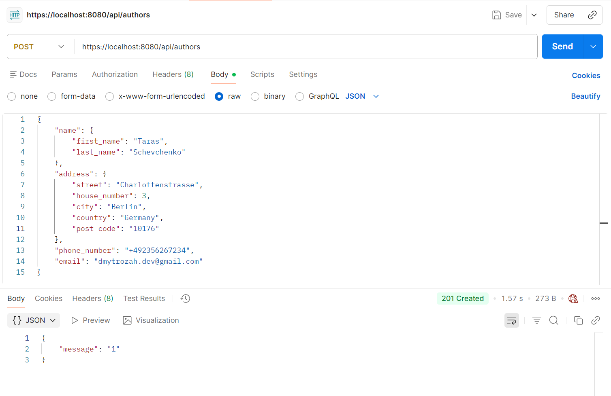

## PS_Task_1

This project features one of the applications developed under the guidance and mentoring during an internship at the company ProfItSoft, the winter fall 2025.

### Objective
In this project we should utilize the object structure and hierarchy from the [PS-1](https://github.com/dmytrozahor/PS_Task_1) (**data domain**). 

We should develop a Spring Boot service, which would store the objects (related as `Many-To-One`) in the database (**Postgre**) and share access to them over an unified `Rest API`

### Requirements

- 11 Endpoints are to be implemented for the `Book` and `BookAuthor` entities.

| Endpoint                   | Example entity                                    | Purpose                                                                                                                                      |
|----------------------------|---------------------------------------------------|----------------------------------------------------------------------------------------------------------------------------------------------|
| `POST /api/books {...}`    | ...                                               | (create)                                                                                                                                     |
| `GET /api/books/{id}`      | ...                                               | (retrieve), including the `author` entity, which it refers, i.e. `"author": {"id": ..., "name": ...}`                                        |
| `PUT /api/books/{id}`      | ...                                               | (update), don't forget the `validation`                                                                                                      | 
| `DELETE /api/books/{id}`   | ...                                               | (delete by `ID`)                                                                                                                             |
| `POST /api/books/_list`    | `{authorsId: ..., ..., "page": ..., "size": ...}` | (list entities), should also return rest pages i.e. `{"list": [...], "totalPages": 5}`                                                       |
| `POST /api/books/_report`  | `{"authorId": 2}`                                 | generate a report in `CSV` or `Excel` format, make browser request download of a file with entities which correspond to the filtration rules |
| `POST /api/books/upload`   | ...                                               | (populate entities from a file)                                                                                                              | 
| `GET /api/authors`         | ...                                               | (list all entities)                                                                                                                          |
| `POST /api/authors {...}`  | ...                                               | (create)                                                                                                                                     |
| `PUT /api/authors/{id}`    | ...                                               | (update)                                                                                                                                     |
| `DELETE /api/authors/{id}` | ...                                               | (delete)                                                                                                                                     |

- 

### Implementation

- Following entities were introduced: `BookData`, `BookAuthor` in the domain and diverse POJOs for the `Rest API` 
- `Layered Architecture`, `Decoupling`, `SOLID` were maintained to provide a clear structure of the application. `*` In particular was developed modular structure with the usage of `Gradle` to separate benchmarks (`jmh`) and main program (`core`) logic
- Test coverage with `integrational` and `Unit tests` using `JUnit 5` and `Spring WebMvc-Test` was established as well.

### Building the application
Use the task `fatJar` in the `app` module or select the `./app/core` as your working directory and run it from the IDE.

### Notes

### Dependency diagram (UML)
